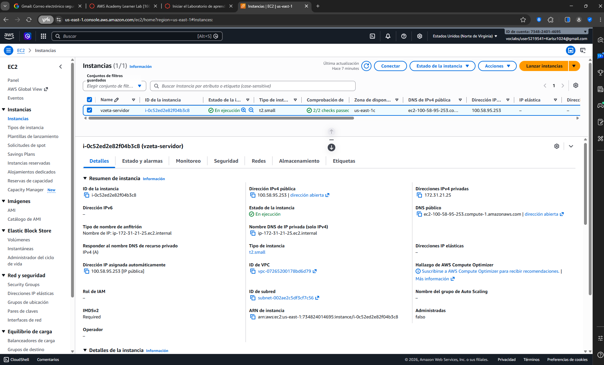
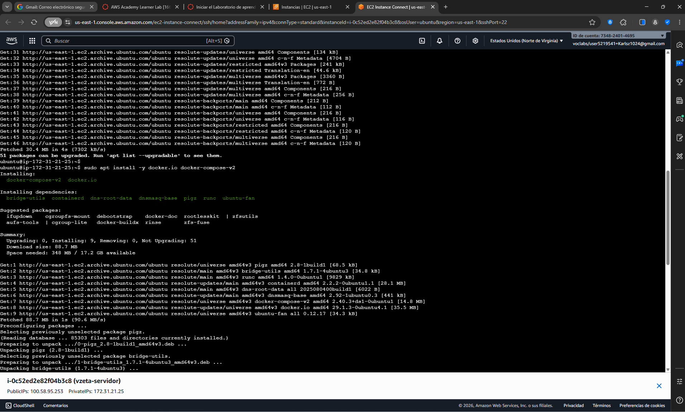

# Evaluación Final Transversal - Despliegue Multi-Contenedor VZeta

**Estudiante:** Carlos Campos (vzeta)  
**Asignatura:** DIY7111 - Entrega de Encargo Individual  
**Plataforma Cloud:** AWS Learner Lab (us-east-1)  
**Instancia:** EC2 `t2.small` - Ubuntu 26.04 LTS  

---

## 1. Justificación Técnica y Arquitectura (IL 1.1, IL 3.4)

### A. Comparativa: Contenedores (Docker) vs. Virtualización Tradicional (Hipervisores)
* **Aislamiento y Recursos:** Los hipervisores tradicionales requieren un Sistema Operativo Invitado completo por cada máquina virtual, lo que genera una alta sobrecarga de CPU, Memoria RAM y almacenamiento. Docker realiza un aislamiento a nivel de proceso compartiendo el Kernel del sistema operativo anfitrión (Ubuntu), consumiendo apenas megabytes de memoria y permitiendo un aprovechamiento óptimo de los recursos asignados en la instancia `t2.small`.
* **Licenciamiento:** Docker Engine opera bajo la licencia de código abierto Apache 2.0, eliminando los costos comerciales asociados a plataformas de virtualización on-premise tradicionales (como las licencias por núcleos de VMware vSphere o Microsoft Hyper-V), adecuándose perfectamente al marco ágil y de bajo costo de VZeta.

### B. Análisis de Entornos de Nube e Infraestructura
Dadas las restricciones de la empresa VZeta (sin soporte para Kubernetes/EKS), se determina el uso de una **Nube Pública** utilizando **Docker Compose**:
* **Nube Pública (AWS):** Provee elasticidad inmediata, IP pública accesible y aprovisionamiento rápido mediante instancias EC2, abstrayendo la administración del hardware físico.
* **Nube Privada vs. Híbrida:** Desplegar una nube privada on-premise requeriría una fuerte inversión en hardware local. Una estrategia híbrida sería ideal a futuro para mantener la base de datos PostgreSQL de forma local por motivos de privacidad regulatoria y el frontend web de Flask en la nube de AWS para absorber tráfico masivo, pero actualmente la solución local con Docker Compose en EC2 cumple eficientemente con los requisitos.

---
## 2. Diagrama de Arquitectura Objetivo (IL 2.4)

```text
Cliente ──▶ HTTP:Puerto 80 ──▶ [ vzeta-nginx ] ──▶ Red Bridge ──▶ [ vzeta-app ] ──▶ [ vzeta-db ]
                               (Proxy Inverso)                       (Flask App)      (PostgreSQL)
                                                                                          │
                                                                                    Volumen Persistente
                                                                                  (postgres_data)

---

## 3. Instrucciones de Despliegue (IL 2.4, IL 3.4)

Para replicar este entorno multi-contenedor en cualquier instancia limpia de AWS EC2 con Docker instalado, ejecute los siguientes comandos:

```bash
# 1. Clonar el repositorio
git clone [https://github.com/carlosz023/diy7111-ea2-carlos-campos.git](https://github.com/carlosz023/diy7111-ea2-carlos-campos.git)
cd diy7111-ea2-carlos-campos

# 2. Desplegar la infraestructura en segundo plano
docker compose up -d --build

# 3. Verificar el estado de los servicios
docker compose ps
---

## 4. Evidencias de Funcionamiento (IL 2.2, IL 3.2, IL 3.3)
### A. Instancia EC2 Activa en AWS Learner Lab


### B. Docker Engine y Plugin Compose Instalados


### C. Imágenes Construidas Correctamente (Flask Propia, NGINX, Postgres)


### D. Stack Multi-Contenedor Levantado en Segundo Plano


### E. Volumen de Persistencia Creado


### F. Salida del Comando Docker Inspect (Sección Mounts de la BD)


### G. Aplicación VZeta Funcionando en el Navegador (Contador de Visitas)

